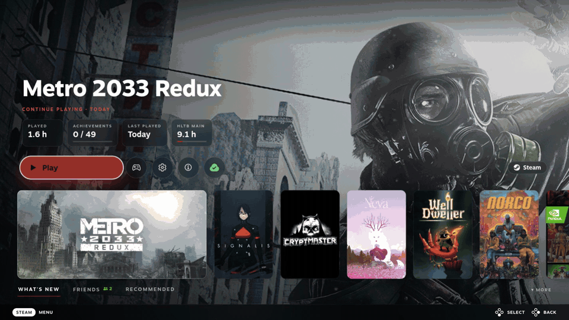

# Game Glance

A [Decky Loader](https://decky.xyz) plugin that turns Steam's game page in Game Mode into an immersive,
full-screen view with everything about a game at a glance: how long it takes to beat, how far you are,
what it is about, and where it came from.


<details>
<summary>More screenshots: a GOG game from Heroic, a TV, and the Quick Access menu</summary>


</details>

## What it does

- **Full-screen art.** The game's hero art fills the screen with its logo; Steam's Activity, Your stuff,
  Community and Game info tabs move to the next screen (press down).
- **Restyled Play row.** A pill-shaped Play button (including the "Play from" arrow some games have), round
  controller and settings buttons, and Steam Cloud as a small icon coloured by sync state.
- **HowLongToBeat.** Main story, Main + Extras and 100% times, a progress bar toward the next one you have
  not reached, and how many hours are left.
- **Info card.** Your play time, achievements and the game's description, in your Steam language.
- **Store pill.** Where the game comes from, with the store's icon: Steam, GOG, Epic, Amazon, Battle.net,
  Ubisoft, Xbox Cloud or Heroic.
- **Non-Steam games.** Games added by [Heroic](https://heroicgameslauncher.com) or
  [Unifideck](https://github.com/mubaraknumann/unifideck) get their store, times and description too. On a
  Unifideck game's page, Unifideck's own Play row (Install, Play) sits on the art in the same style.
- **Works offline.** Times and descriptions are kept on the device. A Quick Access button pre-loads them for
  every installed game, and new installs are picked up automatically.
- **Handheld and TV.** Sizes follow the screen, so it looks the same docked to a TV.

## Spotlight Home (new in 2.0)



Spotlight Home is an optional new Home screen. It is off by default; turn it on in Quick Access.

- **Selected game.** The selected game fills the screen with its art (your custom SteamGridDB art when you have
  set some), with chips (play time, achievements, last played, HowLongToBeat main story), a Play button and
  actions. The accent colour follows each game's art (accent text is lightened, hue kept, when the colour is too dark to read). Focus starts on Play; **L1 and R1 pick the previous or next
  game** (hold to keep going). The d-pad or stick does too: **Left on Play** goes to the previous game and **Right on
  the last button** to the next, with focus back on Play. For Steam games with cloud saves, a cloud button after the info button shows the
  sync state (green, yellow, red, grey) and opens Steam's sync dialog when there is a problem. The gear button, or
  the View/Select button, opens Steam's own menu for the game (favourites, collections, Manage, Properties...), the
  same one as on the game's page.
- **Recents row.** Your recent games as capsules, as many as Steam's own Home lists (up to 20; custom portrait art included); the selected one opens into a
  wide card with the game's landscape art (custom art included) and the row slides to follow L1/R1. The row ends in
  a Library card (R1 past the last game; R1 again goes back to the first) with a faded preview of more games. The
  row is for show only: tapping a card does nothing. With no recent games, Home shows an Open Library button.
- **Feed.** Press down for tabs: **What's new** (news updates, which open the news; under them, as on Steam's Home, the
  games recently updated on this device, with the size and when), **Friends** (your friends, in game first, then online,
  away and offline, kept up to date while Home is open; the number online on the tab turns green when anyone is on,
  and each picture, a small square as in Steam, has a green frame when online or in game, a blue one when away; A on a friend
  in a game you can join asks, then joins them, as Steam's friends menu does; under them, Steam's own
  "Trending among friends" list as small cards: in library, on sale or free to play, and which friends play it) and **Recommended** (Play next
  from your library; under it, with Show wishlist deals on, up to six wishlist games on sale with their discount
  and price). Up and down move between the rows, L1 and R1 switch tabs; B goes back up to Play.
- **Details page to match.** With both toggles on, the Game Glance page gets the same look: accent eyebrow
  and title, a larger Play row and new cards, laid out as in the design. The store pill stays. With Spotlight
  Home off it looks exactly as it did in 1.1.1.
- **Store pill.** The selected game's store (Steam, GOG, Epic...) shows as a pill with its icon and name at the
  right of the Play row, the same pill as on the game page.

Quick Access → Game Glance has two toggles:

| Toggle | Default | Does |
|---|---|---|
| Game Glance page | On | The immersive game page. Off gives Steam's own game page. |
| Spotlight Home | Off | The new Home, and the details restyle above. Off returns Steam's Home at once. |

Any combination works: page on and Spotlight off is the 1.1.1 look; Spotlight on and page off is Spotlight Home
with Steam's own game page.

**What's new, Friends, Recommended** (on by default) shows the tabs under your games. Turn it off and Home shows only
the selected game; nothing for the tabs is loaded then.

**Show wishlist deals** (off by default, shown while the tabs are on) adds up to six wishlist games that are on sale (the biggest discounts)
to the Recommended tab, as a second row. To find them it sends your Steam ID to Steam's web API to read your wishlist, which must
be public, then checks the prices of the whole wishlist on Steam's store (app IDs only) and looks up the name and
Steam Deck rating of the deals shown; their header art loads from Steam's image servers. Nothing else leaves the
device for this; Play next is worked out locally. A private or empty wishlist just hides the shelf.

If anything in Spotlight Home fails, you get Steam's own Home instead of a broken screen.

Known limits: Steam keeps no persistent "last played" game for friends, so Game Glance remembers the last game
it saw each friend play (while Home is open or Steam reports it) and shows it, with that game's card, once they are away or offline;
a friend it never saw playing shows their status. Spotlight Home is new and has had less
testing than the game page; [docs/device-checklist.md](docs/device-checklist.md) lists what is still to be
checked.

## Install

Game Glance is not in the Decky plugin store. Install it from a release:

1. In Game Mode, open Decky → Settings → General and turn on **Developer mode**.
2. Download `game-glance.zip` from the [latest release](../../releases/latest).
3. Decky → Settings → Developer → **Install plugin from ZIP** (or **Install plugin from URL** with the
   release asset's link).

If you use **HLTB for Deck**, you can uninstall it; Game Glance shows the same times on the game page.

## Settings

Quick Access (…) → Game Glance:

- **Game Glance page:** turn it off to get Steam's own game page back.
- **Spotlight Home**, **What's new, Friends, Recommended** and **Show wishlist deals:** see above.
- **HowLongToBeat match:** if a game matches the wrong entry or none, paste its HowLongToBeat link.
- **Pre-load game info for installed games** and **Pre-load new games automatically.**
- **Clear cached data.**

## Compatibility

Tested on a ROG Xbox Ally running Bazzite, handheld and docked to a 1080p TV. It should work on a Steam Deck
and other SteamOS-like devices, but that has not been tested.

Steam updates can rename the parts of the page the theme styles. When that happens, Game Glance turns its
layout off and you get Steam's normal page with the cards on it, rather than a broken page.
[docs/device-checklist.md](docs/device-checklist.md) lists what to check after an update.

## Privacy

Game Glance talks to two sites: howlongtobeat.com (times) and store.steampowered.com (descriptions). It sends
game names and Steam app IDs, nothing about you. The one exception is the optional **Show wishlist deals**
setting (off by default): it sends your Steam ID to Steam's web API (api.steampowered.com) to read your public
wishlist, then asks the store for the prices of the wishlist's games by app ID. Spotlight Home's news, friends
and art come from the Steam client itself (news images load from Steam's image servers, as on Steam's own Home). Trending's store art (for games you do not own, when Steam's "store content on Home" is on), the wishlist deal art with Show wishlist deals on, and your friends' avatars also load from Steam's image servers.
Everything Game Glance stores stays on the device, in Decky's settings folder.

## Development

```bash
pnpm install
pnpm test                         # frontend tests
python3 -m venv .venv && .venv/bin/pip install pytest && .venv/bin/pytest tests/py
pnpm check:hltb                   # live check against howlongtobeat.com
scripts/package.sh                # builds out/game-glance.zip
```

`scripts/serve.sh` serves the zip on your network for **Install plugin from URL**. The `scripts/cef-*.mjs`
helpers drive Steam's UI through remote CEF debugging; see the device checklist for the setup.

## About this project

This is a personal project, maintained on a best-effort basis. Steam and HowLongToBeat change without
notice, so expect occasional breakage; issues are welcome.

The code was written with [Claude](https://claude.ai) (Anthropic's AI), directed, reviewed and tested on
device by the author.

## Credits

- HowLongToBeat lookup code from [HLTB for Deck](https://github.com/morwy/hltb-for-deck) (MIT), including the
  fix from its pull request #68 by beallio. See [THIRD_PARTY_LICENSES.md](THIRD_PARTY_LICENSES.md).
- Times from [HowLongToBeat](https://howlongtobeat.com). Store icons from Simple Icons and Font Awesome via
  [react-icons](https://react-icons.github.io/react-icons/).
- Not affiliated with Valve, HowLongToBeat, ASUS or any store shown.

## License

[MIT](LICENSE)
