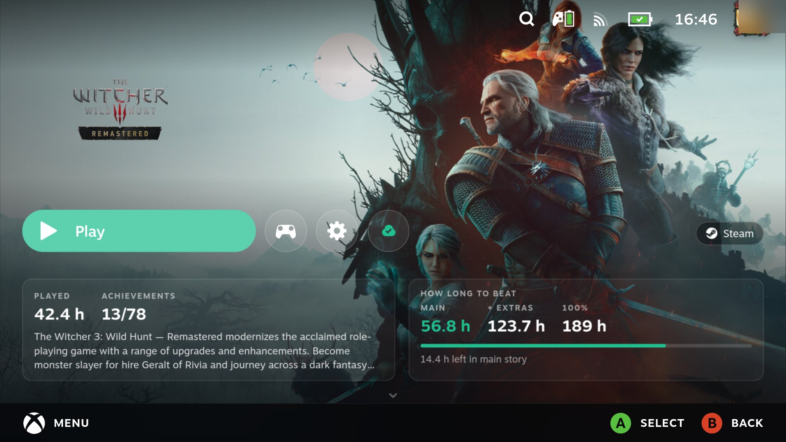
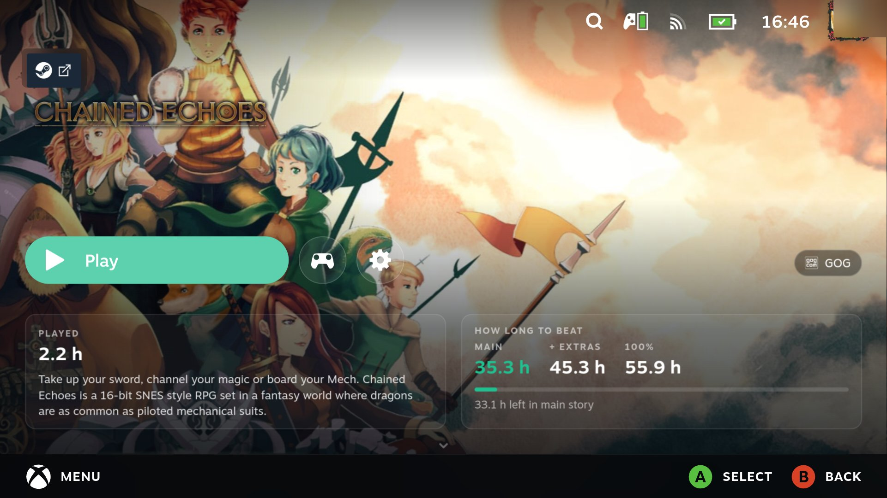
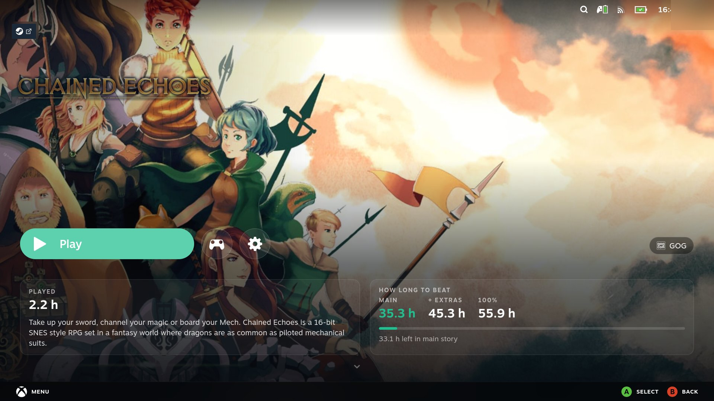
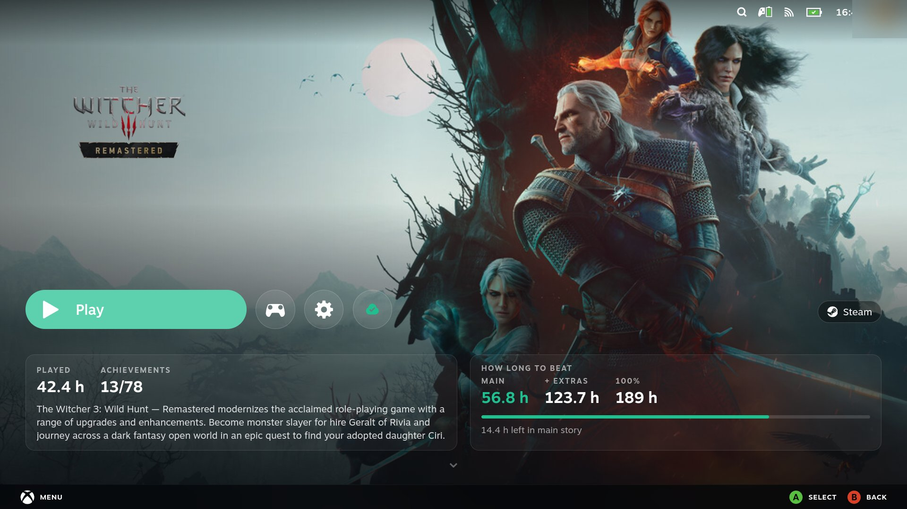
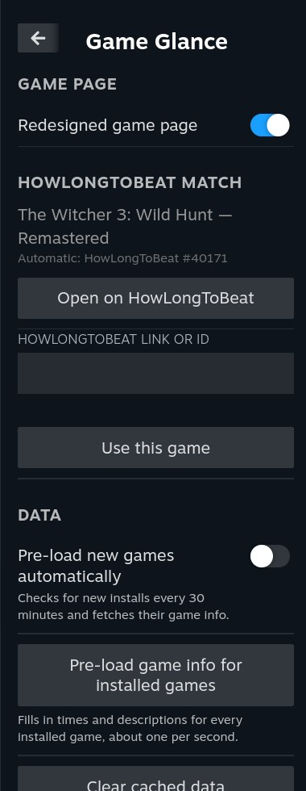

# Game Glance

A [Decky Loader](https://decky.xyz) plugin that turns Steam's game page in Game Mode into an immersive,
full-screen view with everything about a game at a glance: how long it takes to beat, how far you are,
what it is about, and where it came from.



<details>
<summary>More screenshots: a GOG game from Heroic, a TV, and the Quick Access menu</summary>









</details>

## What it does

- **Full-screen art.** The game's hero art fills the screen with its logo; Steam's Activity, Your stuff,
  Community and Game info tabs move to the next screen (press down).
- **Restyled Play row.** A pill-shaped Play button (including the "Play from" arrow some games have), round
  controller and settings buttons, and Steam Cloud as a small icon coloured by sync state.
- **HowLongToBeat.** Main story, Main + Extras and 100% times, a progress bar toward the next one you have
  not reached, and how many hours are left.
- **Info card.** Your play time, achievements and the game's description, in your Steam language.
- **Store pill.** Where the game comes from, with the store's icon: Steam, GOG, Epic, Amazon, Battle.net,
  Ubisoft, Xbox Cloud or Heroic.
- **Non-Steam games.** Games added by [Heroic](https://heroicgameslauncher.com) or
  [Unifideck](https://github.com/mubaraknumann/unifideck) get their store, times and description too.
- **Works offline.** Times and descriptions are kept on the device. A Quick Access button pre-loads them for
  every installed game, and new installs are picked up automatically.
- **Handheld and TV.** Sizes follow the screen, so it looks the same docked to a TV.

## Install

Game Glance is not in the Decky plugin store. Install it from a release:

1. In Game Mode, open Decky → Settings → General and turn on **Developer mode**.
2. Download `game-glance.zip` from the [latest release](../../releases/latest).
3. Decky → Settings → Developer → **Install plugin from ZIP** (or **Install plugin from URL** with the
   release asset's link).

If you use **HLTB for Deck**, you can uninstall it; Game Glance shows the same times on the game page.

## Settings

Quick Access (…) → Game Glance:

- **Redesigned game page:** turn the redesign off to get Steam's own page back.
- **HowLongToBeat match:** if a game matches the wrong entry or none, paste its HowLongToBeat link.
- **Pre-load game info for installed games** and **Pre-load new games automatically.**
- **Clear cached data.**

## Compatibility

Tested on a ROG Xbox Ally running Bazzite, handheld and docked to a 1080p TV. It should work on a Steam Deck
and other SteamOS-like devices, but that has not been tested.

Steam updates can rename the parts of the page the theme styles. When that happens, Game Glance turns its
layout off and you get Steam's normal page with the cards on it, rather than a broken page.
[docs/device-checklist.md](docs/device-checklist.md) lists what to check after an update.

## Privacy

Game Glance talks to two sites: howlongtobeat.com (times) and store.steampowered.com (descriptions). It sends
game names and Steam app IDs, nothing about you. Everything it stores stays on the device, in Decky's
settings folder.

## Development

```bash
pnpm install
pnpm test                         # frontend tests
python3 -m venv .venv && .venv/bin/pip install pytest && .venv/bin/pytest tests/py
pnpm check:hltb                   # live check against howlongtobeat.com
scripts/package.sh                # builds out/game-glance.zip
```

`scripts/serve.sh` serves the zip on your network for **Install plugin from URL**. The `scripts/cef-*.mjs`
helpers drive Steam's UI through remote CEF debugging; see the device checklist for the setup.

## About this project

This is a personal project, maintained on a best-effort basis. Steam and HowLongToBeat change without
notice, so expect occasional breakage; issues are welcome.

The code was written with [Claude](https://claude.ai) (Anthropic's AI), directed, reviewed and tested on
device by the author.

## Credits

- HowLongToBeat lookup code from [HLTB for Deck](https://github.com/morwy/hltb-for-deck) (MIT), including the
  fix from its pull request #68 by beallio. See [THIRD_PARTY_LICENSES.md](THIRD_PARTY_LICENSES.md).
- Times from [HowLongToBeat](https://howlongtobeat.com). Store icons from Simple Icons and Font Awesome via
  [react-icons](https://react-icons.github.io/react-icons/).
- Not affiliated with Valve, HowLongToBeat, ASUS or any store shown.

## License

[MIT](LICENSE)
